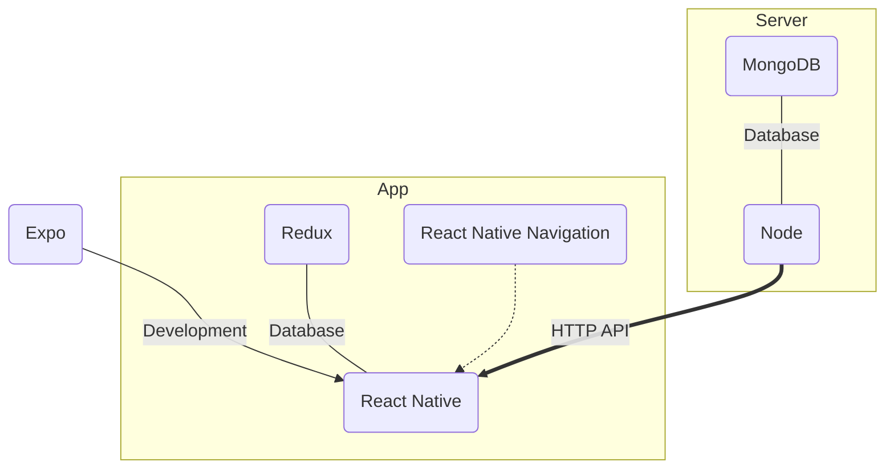

# Application C-Node

---

C-Node est une application mobile qui sert aux enfants et aux adultes dans le cadre scolaire à interagir entre soi et à promouvoir la culture.

## Stack



### Pour les nouveaux développeurs

---

##### Créer une clé SSH pour ne pas devoir entrer ses identifiants à chaque fois

1. (Windows) Installer et utiliser [Git Bash](https://git-scm.com/downloads)

2. ```bash
   ssh-keygen -t ed25519 -C "votre_email@exemple.com" 
   ```

3. (Windows) 

   ```bash
   cat ~/.ssh/id_ed25519.pub | clip
   ```

   (Linux avec le paquet `xclip`)

   ```bash
   xclip -sel clip < ~/.ssh/id_ed25519.pub
   ```

4. Ajouter votre clé à la page [clées](https://gitlab.com/profile/keys)

##### Télécharger et installer votre éditeur préféré (ex: Sublime Text, Atom)

Pour des raisons de simplicités et d'efficacités, nous allons utiliser `Visual Studio Code` (souvent raccourci à `VS Code` ou `VSC`)

- (Windows) Télécharger et installer [içi](https://code.visualstudio.com/download)

- (Linux avec le paquet `snapd` (pré-installé sur Ubuntu) ou avec [apt](https://linuxize.com/post/how-to-install-visual-studio-code-on-ubuntu-18-04/))

  ```bash
  snap install code --classic
  ```

Et n'oubliez pas d'installer l'extension ES Lint pour VS Code avec ``Ctrl``+``P`` puis

```bash
ext install dbaeumer.vscode-eslint
```


### C-node-mobile (Application Mobile)

---

1. (Windows) Télécharger et installer [LTS v12 .msi](https://nodejs.org/en/download/)

   (Ubuntu)

   ```bash
   curl -sL https://deb.nodesource.com/setup_12.x | sudo -E bash -
   sudo apt update && sudo apt install -y nodejs
   ```

   ###### Note: nodeJS et npm sur `apt` ne sont plus entretenus

2. ```bash
   sudo npm install -g expo-cli
   ```

3. Dans le dossier que vous souhaitiez (ex: dans votre dossier Documents)

   ```bash
   git clone git@gitlab.com:jtac-app/c-node-mobile
   cd c-node-mobile
   npm install
   ```
   
   ###### Note: Si vous avez des problèmes avec ce dernier, référez vous aux [problèmes fréquents](#problemes-frequents)
   
4. ```bash
   expo start
   ```

5. Installer [Expo](https://play.google.com/store/apps/details?id=host.exp.exponent) sur votre smartphone, assurez vous d'être sur le même réseau que votre ordinateur et scannez le code QR avec l'application

Bravo! Si vous avez réussit toutes ces étapes, vous êtes prêt à travailler sur l'application. Vous pouvez ouvrir le dossier rapidement dans VS Code avec ``code .`` depuis le dossier. Prochaine étape : apprendre [React Native](https://facebook.github.io/react-native/docs/tutorial) !

### Problemes Frequents

---

1. ```bash
   npm install
   ```

   Fix possible :

   ```bash
   rm -rf node_modules/react-native-paper/node_modules/react-native-safe-area-view/.git
   ```

2. prob 2

3. prob 3